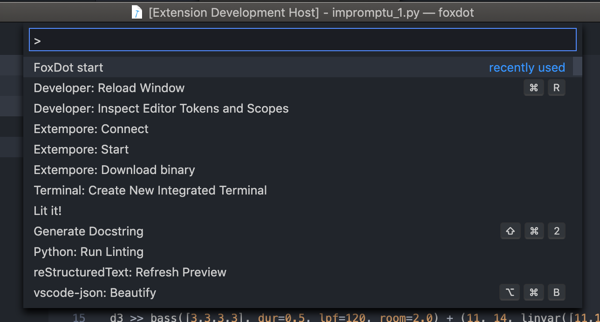
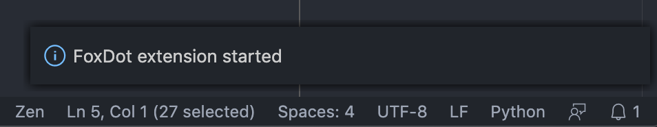
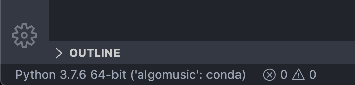
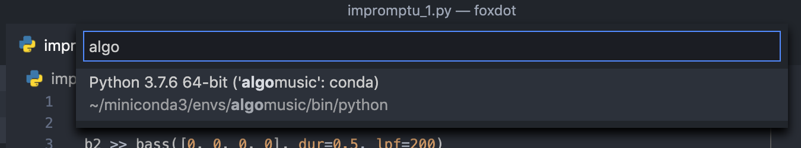

# vscode-foxdot

[ ⚠️ This extension is currently very WIP ⚠️ ]

Perform your live coding music with FoxDot from Visual Studio Code.

## How to use

Once the extension is installed, use `cmd (or ctrl) + shift + P` to run the `FoxDot start` command.

If everything goes well, you'll see a message telling you that FoxDot started correctly.

## Current Features

* Start FoxDot within vscode ✅

* Play the selected line/lines in FoxDot with `cmd (o ctrl)+Enter` ✅

## Future Features

* Custom theme for live coding (in progress at https://github.com/vvzen/vscode-foxdot-darktheme)

* Highlight the current selection after the execution

* Autocompletion for FoxDot

* ..anything people might feel useful?

## Requirements

FoxDot must be installed in the current active python environment (the one you can see in the lower left corner, in this case, the "algomusic" environment)

I suggest using conda and installing FoxDot in its own conda environment in order to avoid messing up your system python or your other modules.
VSCode plays nicely with conda, so once you created your conda env you will just need to click on the right bottom corner and select it:

## Extension Settings

This extension contributes the following settings:

* `foxdot.start`: starts FoxDot
* `foxdot.evaluateSelection`: (or cmd(ctrl)+enter) to send the selection to FoxDot

## Known Issues

To do

## Release Notes

Not much to say, this is my first vscode extension. :)

### 0.0.4

Added logo

**Enjoy!**
